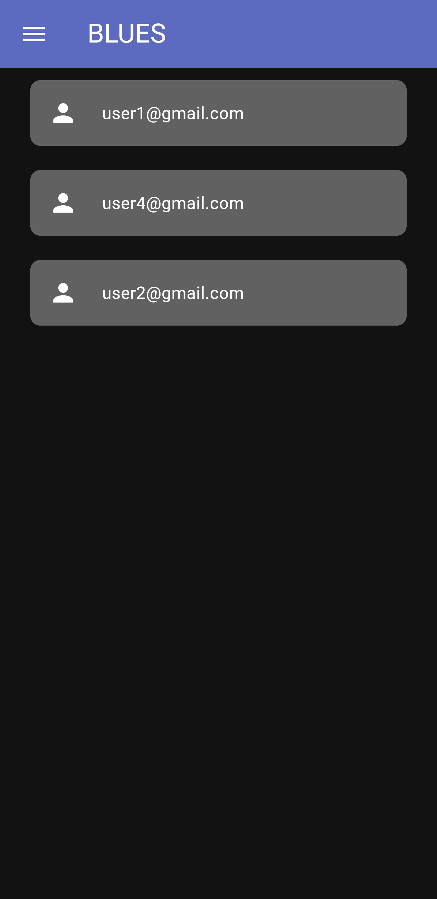
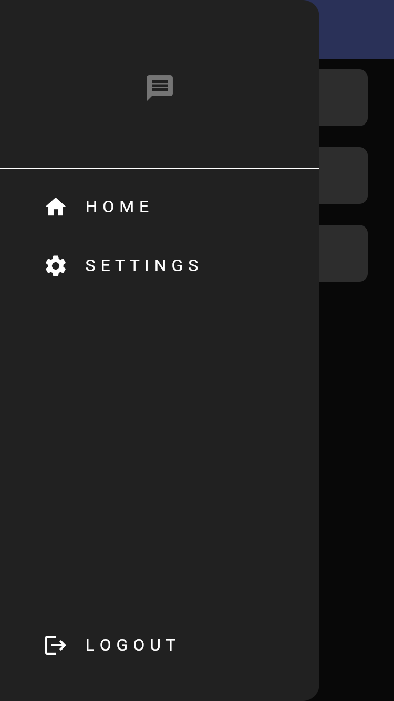
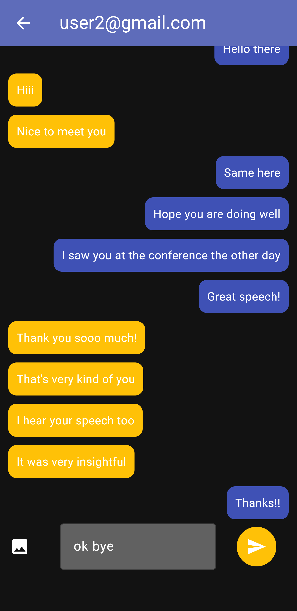

# 💬 BLUES - Flutter Chat App

A modern real-time chat application built using Flutter and Firebase, featuring seamless messaging, media sharing, and a clean UI with theme customization.

---

##  Live Demo
🔗 https://your-deployed-link-here.com

---

##  Features

-  **Real-time Messaging**  
  Instantly send and receive messages powered by Firebase Firestore.

-  **Image Sharing**  
  Upload and send images directly from your device.

-  **Delete Messages**  
  Remove messages with a clean and responsive UI.

-  **Light & Dark Mode**  
  Toggle between light and dark themes for a better user experience.

-  **Authentication**  
  Secure login and registration using Firebase Auth.

-  **Smooth UI/UX**  
  Clean chat interface with auto-scroll and responsive design.

---

##  Tech Stack

- **Frontend:** Flutter  
- **Backend:** Firebase  
- **Database:** Cloud Firestore  
- **Storage:** Firebase Storage  
- **Authentication:** Firebase Auth  

---

##  Screenshots

  
  
  

---

##  Future Improvements

-  Message read receipts (seen/delivered)
-  File sharing (PDF, docs)
-  Push notifications
-  Group chats

---

##  About Me

Hi, I’m **Sibangi Chakraborty** 
A passionate developer building real-world full-stack applications.

 Portfolio: https://sibangi-portfolio-website.netlify.app/

---

## ⭐ Show your support

If you like this project, give it a ⭐ on GitHub!

---
